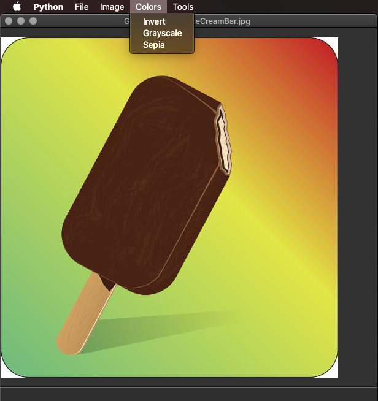
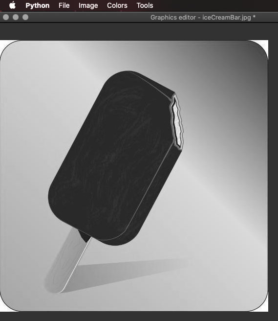

# Apply Image Filters

## About
This application originated as part of a university semester project (FIT CTU/ BI-PYT) 
and was improved with the additional UI approach using the QT library.

## Usage
Run the app with:
```
    python __main__.py
```
The image is opened:



The filter is applied:



### Supported filters and tools:
* Open, Save, Save as... picture
* Brightness +/-
* Noise, Blur, Sharpen filters
* Invert, Grayscale, Sepia color changes 

## Requirements
The project needs a few technologies for running:
- [Python 3](https://www.python.org)
- [PyQt5](https://pypi.org/project/PyQt5/)
- [NumPy](https://numpy.org/)
- [Pillow](https://python-pillow.org)
